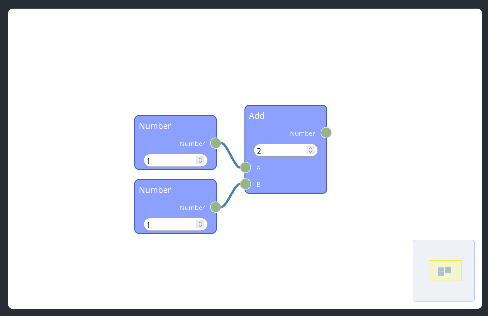

# ReteJS
This is a sample project created to test out ReteJS.

## Creating ReteJS project
To create the ReteJS project, I followed this [documentation](https://retejs.org/docs/development/rete-kit). 

### Create new project
Firstly, you need to install `rete-kit` which is an npm package that simplifies creating reteJS projects built using any of the existing javascript frameworks.

```sh
npm i rete-kit
```

To create the reteJS project I used `rete-kit`'s inquirer mode.

```sh
rete-kit app
```

1. Enter the name of the project.
2. Select the framework of your choice, for the example I used `React.js`.
3. Select version, I used `18`.
4. Select features you want to include. Recommended features: Renderer specific to your framework (ex: `React render`), `Order Nodes`, `Zoom at`, `Auto arrange`, `Dataflow engine`, `Selectable nodes`, `Minimap`.

This successfully creates a new ReteJS project.

### Clone my project

As an alternative to creating a reteJS project from scratch, you can clone this GitHub repository.

```bash
git clone https://github.com/Chanakya-TS/retejs-tut.git
```

## Starting ReteJS project

The following commands start a live development server to view the react app with the sample reteJS project.

```sh
cd retejs-tut
npm install
npm start
```

## Explaining how ReteJS sample project works

The sample reteJS project includes three nodes to emulate addition of two numbers and a mini-map.



The main code for this project lies in [default.ts](/retejs-tut/src/rete/default.ts).

I will walk through parts of the code and explain how it works.

The following section imports necessary plugins for various features. The usage of each plugin will be clear as we discuss other sections of the code.

```ts
import { ClassicPreset as Classic, GetSchemes, NodeEditor } from 'rete';

import { Area2D, AreaExtensions, AreaPlugin } from 'rete-area-plugin';

import {
  ReactPlugin,
  ReactArea2D,
  Presets as ReactPresets,
} from 'rete-react-plugin';

import { createRoot } from 'react-dom/client';

import { DataflowEngine, DataflowNode } from 'rete-engine';

import {
  AutoArrangePlugin,
  Presets as ArrangePresets,
} from 'rete-auto-arrange-plugin';

import { MinimapExtra, MinimapPlugin } from 'rete-minimap-plugin';
```

Let us first define the two types of nodes we need: Number node, Add Node.

A number node serves as an input to the Add node.

```ts
class NumberNode extends Classic.Node implements DataflowNode {
  
  // Defines the size of the node
  width = 180;
  height = 120;

  // Define a constructor that sets the initial number and the callback function whenever this node changes
  constructor(initial: number, change?: (value: number) => void) {
    super('Number'); // This sets the name of the node

    this.addOutput('value', new Classic.Output(socket, 'Number')); // Adds an output to the node

    this.addControl(
      'value',
      new Classic.InputControl('number', { initial, change })
    ); // Adds a control to the node using the intial number and change argument passed into the constructor. This lets you set input number.
  }

  // Defines how data flows through the node
  data() {
    const value = (this.controls['value'] as Classic.InputControl<'number'>)
      .value; // This grabs the value set by the Input control.

    return {
      value, // Outputs the same value
    };
  }
}
```

Now, lets define the add node which takes in two inputs and displays the sum of the two numbers.

It has a very similar structure to the Number node.

```ts
class AddNode extends Classic.Node implements DataflowNode {

  // Defines the size of the node
  width = 180;
  height = 195;

  constructor() {
    super('Add'); // Defines the name of the node

    // Defines two inputs (i.e. a and b)
    this.addInput('a', new Classic.Input(socket, 'A'));
    this.addInput('b', new Classic.Input(socket, 'B'));

    // Defines an output
    this.addOutput('value', new Classic.Output(socket, 'Number'));

    // Adds an input contorol with initial value of 0 and sets it to read only. This is intended to display the sum of the two input numbers.
    this.addControl(
      'result',
      new Classic.InputControl('number', { initial: 0, readonly: true })
    );
  }

  // Defines the data flow
  // Declares two inputs (a, b)
  data(inputs: { a?: number[]; b?: number[] }) {

    // Calculates the sum
    const { a = [], b = [] } = inputs;
    const sum = (a[0] || 0) + (b[0] || 0);

    // Sets the InputControl to display the sum
    (this.controls['result'] as Classic.InputControl<'number'>).setValue(sum);

    // Sets the output of the node to be sum
    return {
      value: sum,
    };
  }
}
```

After declaring the two types of the nodes, the environment needs to be setup.

The following code does that:

```ts
  const editor = new NodeEditor<Schemes>();
  const area = new AreaPlugin<Schemes, AreaExtra>(container);

  const reactRender = new ReactPlugin<Schemes, AreaExtra>({ createRoot });

  const minimap = new MinimapPlugin<Schemes>();

  editor.use(area);
  area.use(reactRender);

  area.use(minimap);

  reactRender.addPreset(ReactPresets.classic.setup());
  reactRender.addPreset(ReactPresets.minimap.setup());

  const dataflow = new DataflowEngine<Schemes>();

  editor.use(dataflow);
```

The following section creates instances of the nodes and adds the connections.

```ts
  const a = new NumberNode(1, process); // Initial number 1 and calls process function whenever node changes
  const b = new NumberNode(1, process);
  const add = new AddNode();

  await editor.addNode(a);
  await editor.addNode(b);
  await editor.addNode(add);

  await editor.addConnection(new Connection(a, 'value', add, 'a'));
  await editor.addConnection(new Connection(b, 'value', add, 'b'));
```

The following section enables and sets up other other features

```ts
  // AutoArrangePlugin - Arranges the nodes automatically
  const arrange = new AutoArrangePlugin<Schemes>();

  arrange.addPreset(ArrangePresets.classic.setup());

  area.use(arrange);

  await arrange.layout();

  // Automatically zooms in the area of interest
  AreaExtensions.zoomAt(area, editor.getNodes());

  AreaExtensions.simpleNodesOrder(area);

  // Allows selecting nodes and selecting multiple nodes using Ctrl
  const selector = AreaExtensions.selector();
  const accumulating = AreaExtensions.accumulateOnCtrl();

  AreaExtensions.selectableNodes(area, selector, { accumulating });
```

This sections defines the callback function to be called whenever the NumberNode changes.

```ts
// Callback function 
// Goes through every instance of AddNode and updates the result
async function process() {
    dataflow.reset();

    editor
      .getNodes()
      .filter((node) => node instanceof AddNode)
      .forEach(async (node) => {
        const sum = await dataflow.fetch(node.id);

        console.log(node.id, 'produces', sum);

        area.update(
          'control',
          (node.controls['result'] as Classic.InputControl<'number'>).id
        );
      });
  }
```

Viola! Now, you have a functioning reteJS project!